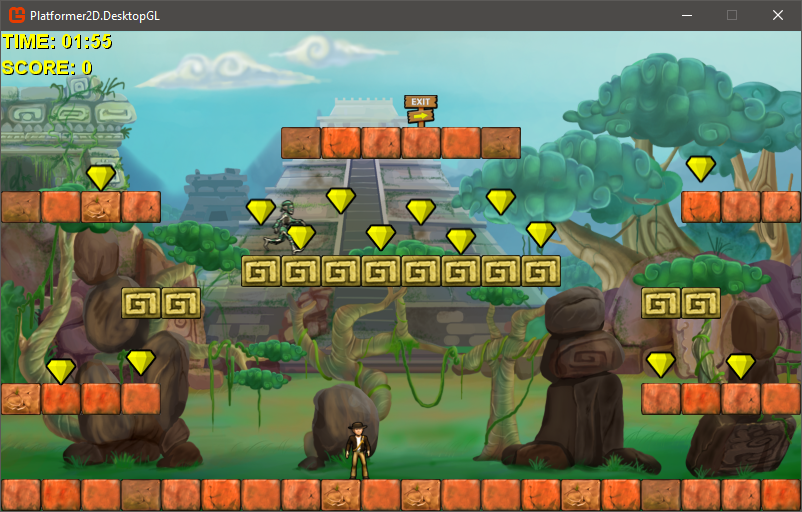
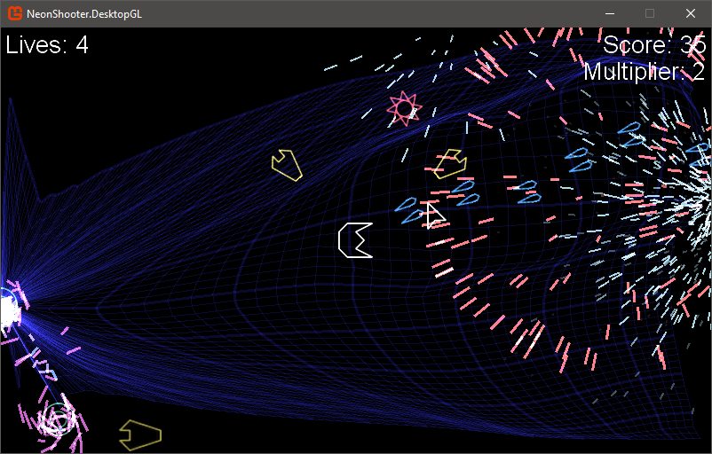
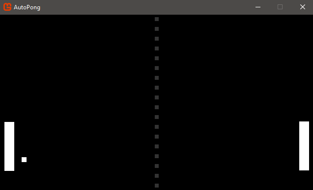

# MonoGame 3.8.4 Samples

 
  
 
 

A number of simple MonoGame samples for all the supported platforms:

|[Platformer 2D Sample](Platformer2D/README.md) | [NeonShooter](NeonShooter/README.md)|
|-|-|
|Supported on all platforms | Supported on all platforms |
| |  |
|The [Platformer 2D](Platformer2D/README.md) sample is a basic 2D platformer pulled from the original XNA samples and upgraded for MonoGame.| [Neon Shooter](NeonShooter/README.md) Is a graphically intensive twin-stick shooter with particle effects and save data from Michael Hoffman |
|||

| [Auto Pong Sample](AutoPong/README.md) | [Ship Game 3D](ShipGame/README.md) |
|-|-|
| Supported on all platforms | GL / DX/ iOS / Android |
|  |  |
| A short [sample project](AutoPong/README.md) showing you how to make the classic game of pong, with generated soundfx, in 300 lines of code. | 3D Ship Game (Descent clone) sample, pulled from the XNA archives and updated for MonoGame |
|||

## New multi-platform sample template and getting started guide

A new template sample is also available which guides through the building of a MonoGame project from start to finish.

|[FuelCell Sample](FuelCell/README.md) | [New 2D learn sample](Tutorials/learn-monogame-2d/README.md) |
|-|-|
|Supported on all platforms | Desktop / Console Platforms |
| |  |
|A [full featured 3D project](FuelCell/README.md) with full documentation from start to finish for building a 3D style game. | The source for the [complete guide to building 2D games with MonoGame](https://docs.monogame.net/articles/tutorials/building_2d_games) tutorial. |
|||

## Building the samples

These samples can either be opened and built in Visual Studio for Mac or Windows, alternatively they can be built with the .NET Core tool chain (with the exception of the Windows UWP sample, which is Windows 10 only).

> **Note:** If using CI nugets, be sure to unzip the nugets to an accessible directory. Then make sure that you add the directory to the list of nuget sources on your machine. Something like:  `dotnet nuget add source [unzipped-directory-location] -n MG-Nugets`

For more details on building projects with the .NET Core tools, please see [this guide on the MonoGame documentation site](https://docs.monogame.net/articles/getting_started/packaging_games.html) and for more details on [nuget package sources](https://learn.microsoft.com/en-us/dotnet/core/tools/dotnet-nuget-add-source).

## Supported platforms

The MonoGame samples demonstrate all the public platforms available for use.

> Platforms such as XBox, Playstation, Switch and Stadia are private platforms which you need developer accounts with their corresponding vendors to access.

* Windows (Desktop GL, Windows DX, UWP)
* Mac (Desktop GL)
* Linux (Desktop GL)
* Android (Android)
* iOS (iOS)

> **Note:** to build a project for iOS or Mac, you will need a MAC.  They will build on Windows but cannot be published unless built on a Mac.

For more details on the platforms supported by MonoGame, please see the [Platforms Guide](https://docs.monogame.net/articles/platforms/0_platforms.html) on the MonoGame Documentation site
