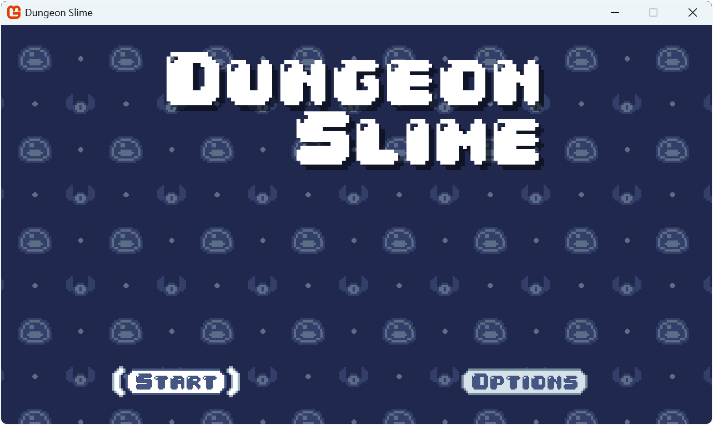
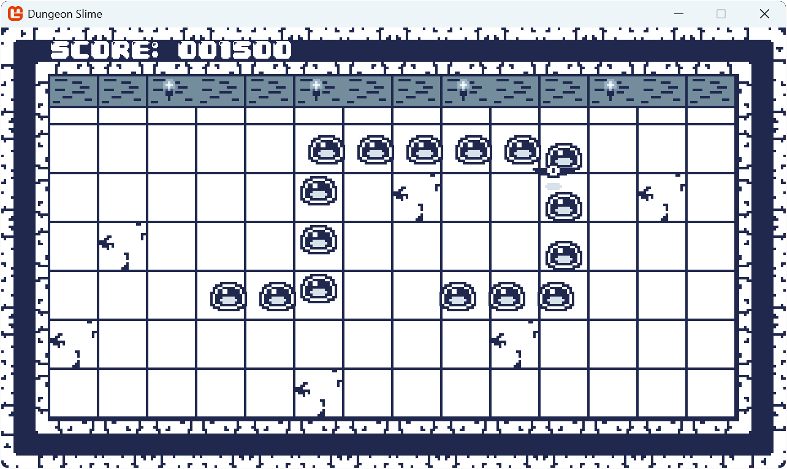

# Building 2D Games with MonoGame

This repository contains the complete source code and examples for the "[Building 2D Games with MonoGame](https://docs.monogame.net/articles/tutorials/building_2d_games/)" tutorial series. The series guides you through creating a fully functional 2D game called "Dungeon Slime" while teaching fundamental game development concepts.

The completed game is a snake-like experience with a dungeon theme, featuring:

- Animated sprites with smooth movement.
- Tile-based level design.
- Sound effects and background music.
- Custom UI with menus and gameplay information.
- Visual effects using shaders.
- Complete gameplay loop with scoring and game states.

|  |  |
| :-------------------------------------------------------------: | :--------------------------------------------------------: |
|                The title screen of Dungeon Slime                |                 Gameplay of Dungeon Slime                  |

<!-- A playable version of the finished game is available at: [Dungeon Slime on itch.io](https://monogame.itch.io/dungeon-slime) -->

## About the Tutorial

This tutorial series walks you through the complete process of building a 2D game using MonoGame, from setting up your development environment to publishing your finished game. Each chapter builds upon previous knowledge, gradually introducing new concepts and techniques.

The tutorial is designed for:

- Developers with basic C# knowledge looking to get started with game development.
- Programmers interested in learning MonoGame's approach to cross-platform game creation.
- Anyone wanting to understand the fundamentals of 2D game development.

## Tutorial Structure

The tutorial series is organized into 27 chapters, each focusing on specific aspects of game development:

### Getting Started with MonoGame

- [Introduction](https://docs.monogame.net/articles/tutorials/building_2d_games/) - Overview of the tutorial series and the game we will build.
- [Chapter 01: What is MonoGame](https://docs.monogame.net/articles/tutorials/building_2d_games/01_what_is_monogame/) - Introduction to MonoGame, its history, and features.
- [Chapter 02: Getting Started](https://docs.monogame.net/articles/tutorials/building_2d_games/02_getting_started/?tabs=windows) - Setting up your development environment.
- [Chapter 03: The Game1 File](https://docs.monogame.net/articles/tutorials/building_2d_games/03_the_game1_file/) - Understanding the foundation of MonoGame projects.
- [Chapter 04: Creating a Class Library](https://docs.monogame.net/articles/tutorials/building_2d_games/04_creating_a_class_library/?tabs=vscode) - Building reusable game components.

### Graphics and Rendering

- [Chapter 05: Content Pipeline](https://docs.monogame.net/articles/tutorials/building_2d_games/05_content_pipeline/?tabs=vscode) - Managing game assets.
- [Chapter 06: Working with Textures](https://docs.monogame.net/articles/tutorials/building_2d_games/06_working_with_textures/) - Rendering images to the screen.
- [Chapter 07: Optimizing Texture Rendering](https://docs.monogame.net/articles/tutorials/building_2d_games/07_optimizing_texture_rendering/) - Using texture atlases for efficiency.
- [Chapter 08: The Sprite Class](https://docs.monogame.net/articles/tutorials/building_2d_games/08_the_sprite_class/) - Creating reusable sprite components.
- [Chapter 09: The AnimatedSprite Class](https://docs.monogame.net/articles/tutorials/building_2d_games/09_the_animatedsprite_class/) - Adding animation to your sprites.

### Input and Interaction

- [Chapter 10: Handling Input](https://docs.monogame.net/articles/tutorials/building_2d_games/10_handling_input/)s - Working with keyboard, mouse, and gamepad.
- [Chapter 11: Input Management](https://docs.monogame.net/articles/tutorials/building_2d_games/11_input_management/) - Creating a robust input system.
- [Chapter 12: Collision Detection](https://docs.monogame.net/articles/tutorials/building_2d_games/12_collision_detection/) - Detecting interactions between game objects.
- [Chapter 13: Working with Tilemaps](https://docs.monogame.net/articles/tutorials/building_2d_games/13_working_with_tilemaps/) - Building tile-based game environments.

### Audio and User Interface

- [Chapter 14: SoundEffects and Music](https://docs.monogame.net/articles/tutorials/building_2d_games/14_soundeffects_and_music/) - Adding audio to your game.
- [Chapter 15: Audio Controller](https://docs.monogame.net/articles/tutorials/building_2d_games/15_audio_controller/) - Managing game audio effectively.
- [Chapter 16: Working with SpriteFonts](https://docs.monogame.net/articles/tutorials/building_2d_games/16_working_with_spritefonts/) - Displaying text in your game.
- [Chapter 17: Scenes](https://docs.monogame.net/articles/tutorials/building_2d_games/17_scenes/) - Managing different game screens and states.
- [Chapter 18: Texture Sampling](https://docs.monogame.net/articles/tutorials/building_2d_games/18_texture_sampling/) - Creating scrolling backgrounds and visual effects.
- [Chapter 19: User Interface Fundamentals](https://docs.monogame.net/articles/tutorials/building_2d_games/19_user_interface_fundamentals/) - Learning UI design principles.
- [Chapter 20: Implementing UI with Gum](https://docs.monogame.net/articles/tutorials/building_2d_games/20_implementing_ui_with_gum/?tabs=vscode) - Creating functional UI elements.
- [Chapter 21: Customizing Gum UI](https://docs.monogame.net/articles/tutorials/building_2d_games/21_customizing_gum_ui/) - Styling UI to match your game theme.

### Game Mechanics and Distribution

- [Chapter 22: Snake Game Mechanics](https://docs.monogame.net/articles/tutorials/building_2d_games/22_snake_game_mechanics/) - Implementing core snake-like gameplay.
- [Chapter 23: Completing the Game](https://docs.monogame.net/articles/tutorials/building_2d_games/23_completing_the_game/) - Finalizing game mechanics and states.
- [Chapter 24: Shaders](https://docs.monogame.net/articles/tutorials/building_2d_games/24_shaders/) - Creating custom visual effects.
- [Chapter 25: Packaging Your Game for Distribution](https://docs.monogame.net/articles/tutorials/building_2d_games/25_packaging_game/?tabs=windows) - Preparing your game for players.
- [Chapter 26: Publishing Your Game to itch.io](https://docs.monogame.net/articles/tutorials/building_2d_games/26_publish_to_itch/) - Distributing your game online.
- [Chapter 27: Conclusion and Next Steps](https://docs.monogame.net/articles/tutorials/building_2d_games/27_conclusion/) - Continuing your game development journey.

## Repository Structure

Each chapter's source code is contained in its own folder, allowing you to:

- See the progressive development of the game throughout the tutorial.
- Compare implementations between chapters to understand new concepts.
- Use specific chapters as starting points for your own projects.

## Getting Started

To begin using this repository:

1. Clone or download the repository.
2. Follow the setup instructions in [Chapter 02: Getting Started](https://docs.monogame.net/articles/tutorials/building_2d_games/02_getting_started/?tabs=windows).
3. Each chapter folder contains a complete, working project representing that stage of development.
4. For the full learning experience, we recommend following the tutorial chapters in sequence.

## Resources

For additional help and information:

- [MonoGame Documentation](https://docs.monogame.net/)
- [MonoGame Community Discord](https://discord.gg/monogame)
- [MonoGame GitHub Repository](https://github.com/MonoGame/MonoGame)
